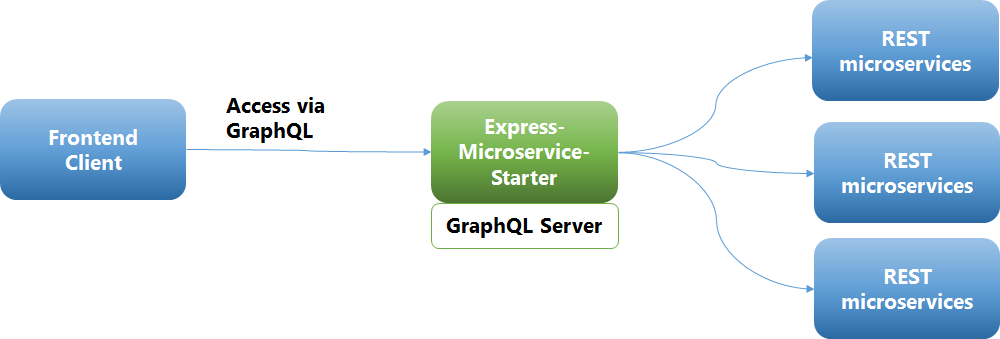

# Stellar Microservice
---

Cloud Native Node JS Express Reactive Microservice Starter Template (REST/GraphQL)
This project provides complete Node JS / Typescript based microservices template with all that will be needed features for production deployment , monitoring , debugging , logging , security , CI/CD. Reactive extensions based samples are added as well to demonstrate how this can be used for building a microservice API edge-service , a backend for frontend or use it as a base for building any kind of microservice.

# Table of contents

- [Design Principles](#design-principles)
- [Features](#features)
- [REST APIs](#rest-apis)
- [GraphQL APIs](#graphql)
- [GraphQL Client APIs](#graphql-client-apis)
- [Installation Prerequisites](#pre-requisites)
- [Installation](#install-it)
- [External Environment Configuration Details](#setup-external-environment)
- [Build Modes](#run-it)
  - [Development](#run-in-development-mode)
  - [Production](#run-in-production-mode)
  - [Debug in VSCode](#run-in-vs-code-debug-mode)
- [Tests](#runs-tests-with-code-coverage)
  - [Unit Tests](#run-unit-tests)
  - [Integration Tests](#run-integration-tests)
- [Run It](#try-it)
- [File Structure](#file-structure)
- [Passing UUID for requests](#log-with-uuid)
- [GraphQL Directives](#graphql-directives)
- [GraphQL Mocks](#graphql-mocks)
- [REST API Mocks](#restapi-mocks)
- [Docker Build](#build-docker-image)
- [Kubernetes Deployment](#k8s-deployment)
- [Debug Dashboard](#using-node-dashboard-view-development-only)
- [Security](#security)
  - [JWT GraphQL APIs](#jwt-security-graphql)
  - [JWT REST APIs](#jwt-security-rest-apis)
    - [Role Based Access](#rbac-test)
  - [CSRF](#csrf-security)
  - [Compression](#compression)
- [Hystrix Support](#hystrix-circuit-breaker-support)
- [Sonar Integration](#integrate-with-sonarqube-for-continous-code-quality)
- [Load Testing](#load-testing)
- [Future Roadmap](#future-roadmap)
- [Deploying to Heroku](#deploying-to-heroku)
- [FAQ](#faq)
- [License](#license)

## Design Principles

- Use best of breed modules to create a production ready microservice framework
- Based on the 12-factor app principles
- No custom code or wrappers so that any developer can modify/replace any of the modules or implementation
- Design patterns for implementation that can be used as a reference
- Modular , replacable and plug and play code
- Provide a starter for both the business APIs and microservice platform development.
- DevOps ready with code quality, unit & integration tests, deployment automated.

## Features

- Node JS, Express, Typescript , Dependency Injection base
- Backpack (webpack) based - build , development , packaging
- Swagger Enabled - Express swagger middleware / Swagger UI integration
- GraphQL based on Apollo Server 2.0 with JWT security , data loader and REST data source samples
- Support for GraphQL SDL via graphql-import
- GraphQL mock resolvers (optional) during development - graphql-tools
- GraphQL based client wrapper APIs - graphql-request
- REST APIs - using Inversify Controller
- Externalized Configuration - DotEnv (Settings, Env specific API URLs)
- Tests - Jest , SuperTest , GraphQL Tester. Infrastructure for automated unit and integration tests
- Code Coverage - Istanbul
- Code Quality - tslint
- Container support - Docker , Kubernetes Clusters
- Helm Chart based deployment support
- Prometheus integration
- API Response Logging , Express Server Logging , UUID propogation - Pino
- Reactive Extensions support - RxJS6
- CORS, JSONObject Limit , Helmet , CSRF - Express Security
- IOC / Dependency Injection / Express Annotation based APIs - Inversify
- Documentation - TypeDocs
- API Exception Handling Utilities
- Standard HTTP Codes for cleaner code
- Sample APIs, Patterns for reference
- Sonar Qube integration
- Hystrix Circuit Breaker Support (Using Brakes)
- JWT Based API Security - jsonwebtoken, express-jwt
- Now using the super fast pino logger for all logging needs
- Additional performance time logging built in

See REST API /examples/{id}

### REST APIs
- The API Spec can be downloaded using the following URLS
```
http://localhost:3000/v1/docs
```
```
http://localhost:3000/api-docs/
```
- examples - Basic examples with a search by ID example from the jsonplaceholder API (/examples/:id)
- shop - Example of how to use Reactive Extensions for API orchestration (FlatMap) (/shop/priceByOptionId/:id)
- starwars - Example of how to use Reactive Extensions for API orchestration (ForkJoin) (/starwars/people/:id)
- hystrix - Example of how to use the circuit break pattern for APIs (/hystrix)
- scraper - Example of how to use scrape-it to scrape data from a website (/scraper)
- Use swagger UI for the complete list of sample APIs
- metrics - Prometheus based metrics added for all APIs (/metrics)
- API Partial JSON response support

### GraphQL

- GraphQL support has been added based on the [apollo framework](https://github.com/apollographql) and a reference implementation (including the starwars apis from swapi.co)
  
- Access the graphql playground from http://localhost:3000/playground
- Access the graphiql tool from http://localhost:3000/graphiql
- GraphQL API tracing (configurable)
- Dataloader for caching and batching
- VSCode Debug Launch Configuration (Preconfigured Debug Launcher added)
- Node Dashboard view added for telemetry during development process
- Added NodeJS cluster mode (load balanced workers)
  - When you start the server it adds workers based on the number of CPUs

```bash
Master cluster setting up 4 workers...
Worker 2828 is online
Worker 2816 is online
Worker 13956 is online
Worker 3756 is online
up and running in development @: LP-507B9DA1D355 on port: 3000
up and running in development @: LP-507B9DA1D355 on port: 3000
up and running in development @: LP-507B9DA1D355 on port: 3000
up and running in development @: LP-507B9DA1D355 on port: 3000
```

## Pre-requisites

Install npm and nodeJS

npm version >= 3.x
node version >= 6.x

## Install It

```bash
npm install
```

## Setup _external environment_

- Edit the **.{PROFILE}.env** file (where the PROFILE could be test, development , production)

| Variable              | Description                                                                                             | Default Value |
| --------------------- | ------------------------------------------------------------------------------------------------------- | ------------- |
| PORT                  | Server Port                                                                                             | 3000          |
| LOG_LEVEL             | Log Level (info,debug,error)                                                                            | info          |
| SESSION_SECRET        | String used for signing cookies                                                                         |               |
| API_TIME_OUT          | Default API Timeout (in milli secs)                                                                     | 10000         |
| TEST_TIME_OUT         | Default Test Timeout (in milli secs)                                                                    | 10000         |
| JWT_AUTH              | Enable/Disable JWT based API security                                                                   | true          |
| RSA_PRIVATE_KEY_FILE  | Sample RSA private key path                                                                             |               |
| RSA_PUBLIC_KEY_FILE   | Sample RSA public key path                                                                              |               |
| TOKEN_EXPIRY_TIME     | JWT Token expiry (Generated from /login )                                                               | 1 hour (1h)   |
| STREAM_HYSTRIX        | Enable/Disable Hystrix streaming server (true or false)                                                 | false         |
| CORS                  | Enable/Disable CORS on the server (true or false). Will work only in production build                   | false         |
| CLUSTER_MODE          | Enable/Disable Node Clustering on the server (true or false)                                            | false         |
| SWAGGER_API_DOCS_ROOT | Serves your Swagger API file(s) so they can be used with front-end tools like like Swagger UI, PostMan. | /api-docs/ |
| GRAPHQL_SUBSCRIPTIONS | Enable/Disable GraphQL subscriptions (true or false)                                                    | true          |
| GRAPHQL_PLAYGROUND    | Enable/Disable GraphQL Playground (true or false)                                                       | true          |
| GRAPHQL_TRACING       | Enable/Disable GraphQL tracing (true or false)                                                          | true          |
| GRAPHQL_MOCK          | Enable/Disable GraphQL Mock for unimplemented Interfaces(true or false)                                 | true          |
| API_MOCK              | Enable/Disable REST API Mock unimplemented routes(true or false)                                        | true          |

## Run It

### Run in _development_ mode

```bash
npm run dev
```

### Run in _production_ mode

```bash
npm run compile
npm start
```

#### Run in _VS Code debug_ mode

```bash
npm run compile
Press F5
```

#### Runs tests with code coverage

#### Run Unit Tests

- Unit Tests are located in the same directory as the module or class being tested
- All Unit tests need to have an extension \*.spec.ts

```bash
npm run test
```

#### Run Integration Tests

- Integration tests are located in the same directory as the module or class being tested
- All Unit tests need to have an extension \*.itest.ts
- First built the integration test . This will setup the integration test environment in the build

```bash
npm run itest:build
```

- Run the node server and run the integration tests against it
- This waits for the server to start , runs the test and then terminate all processes on completion

```bash
npm itest:run
```

### Try It

- Point you're browser to [http://localhost:3000](http://localhost:3000).
- Invoke the example REST endpoints directly or via swagger `http://localhost:3000/v2/docs`
- Invoke the prometheus metrics using the endpoint `curl http://localhost:3000/metrics`
- Access in-browser IDE for graphQL `http://localhost:3000/graphiql`
- Access the graphQL playground app `http://localhost:3000/playground/`
- Access the health check api `curl http://localhost:3000/healthcheck`
